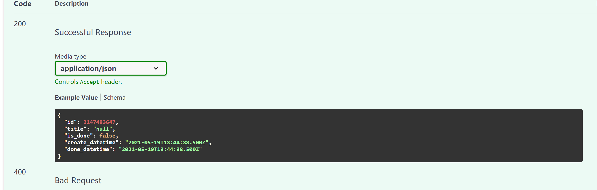
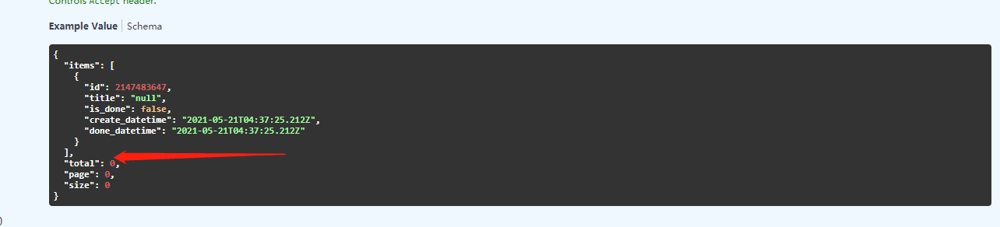
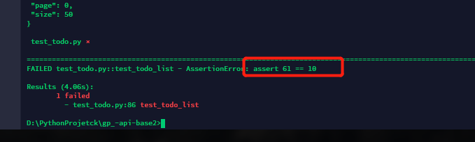
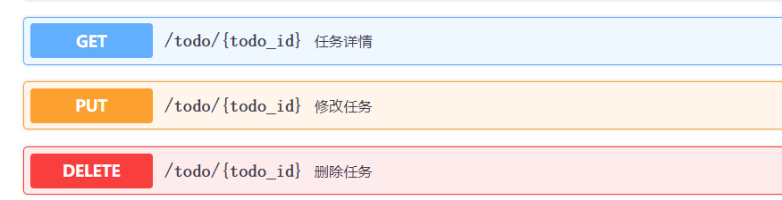

[TOC]


## 熟悉项目

项目名称： TodoList
项目地址：Todo list - Vue.js
接口文档：三木的接口自动化测试练习v2 - Swagger UI
接口协议 ：Restful API （OpenAPI3.0）
接口地址1：https://api.tttt.one/rest-v2/login/access_token
接口地址2：https://api.tttt.one/rest-v2/login/sign_up
接口地址3: http://127.0.0.1:8000/todo
其他信息：
接口的BaseURL ： https://api.tttt.one/rest-v2
 登录后才可用使用系统
部分接口会返回204 （例如 DELETE https://api.tttt.one/rest-v2/todo/3）

## 搭建环境

创建Python项目，并编写自动化测试代码

## 选择工具：

HTTPClient ： requests
测试框架： pytest
框架插件：
创建项目：
创建PyCharm项目
创建虚拟环境
列出第三方包依赖 (pip管理 requirements.txt ）
pytest
requests

# 测试用例

测试登录接口

```python
from log import LoggerSession
import pytest
session = LoggerSession()
base_url = "https://api.tttt.one/rest-v2"
def test_login_sign_up():
    data = {
        "email":"enling@qq.com",
        "password":"enling@qq.com"
    }
    res = session.post(url=f"{base_url}/login/access_token",json=data)
    assert res.status_code == 200
```

## 全局性管理接口数据

1. 查看所有的接口信息
   1. 用途
   2. 地址、参数、鉴权
2. 接口的分组
   1. 相关性
   2. 依赖性
3.  结果依赖分析
4.  设计测试用例
   1. 正向用例
   2. 反向用例


### 封装请求参数

把接口所用到的所有请求体 和断言 封装在一个容器中

```python
from collections import namedtuple
api_info_temp= namedtuple("api_info", ['method','url','body',"params",'code','res_body'])

api_info = dict(
    注册 = api_info_temp(
        method="POST",
        url="/login/sign_up",
        body={},
        params = {},
        code =200,
        res_body = {
  "id": 2147483647,
  "email": "user@example.com",
  "create_datetime": "2021-05-09T07:20:06.054Z",
  "update_datetime": "2021-05-09T07:20:06.054Z"
}
    ),
     登录 = api_info_temp(
        method="POST",
        url = "/login/access_token",
        body = {
            "email":"senling@163.com",
            "password":"senling@163.com"
        },
        params = {},
        code = 200,
        res_body={
          "access_token": "string",
          "token_type": "string"
        }
    )
    
)

#print(api_info["注册"].method)  打印下看看能不能获取
>>>POST
```

### 用例调用参数

```python

def test_user_login():
    api_name = "登录"
    res = session.request(
        api_info[api_name].method,
        f"{base_url}{api_info[api_name].url}",
        json=api_info[api_name].body
    )
    assert res.status_code == api_info[api_name].code
```


## 随机注册数据不同用户

```python
import time #导入时间模块


class Test_Run_user:
    def test_login_sign_up(self):
        """
        测试注册
        生成时间戳 作为账号密码进行注册
        """
        email = f"{time.time():.2f}@121"
        password = email

        api_name = "注册"
        res = session.request(api_info[api_name].method,
                           f"{base_url}{api_info[api_name].url}",
                           json={"email":email,"password":password})
        assert res.status_code == api_info[api_name].code
        assert res.json().keys() == api_info[api_name].res_body.keys()
```

## 传递依赖参数

测试验证token的接口

需要从登录接口获取token后再进行验证  但是不要在测试登录接口的用例中获取  因为用例与用例之间是相互独立的  

可以在 请求验证token之前 但是发送一次登录请求 获取token  

```python
def test_token_user(self):
    """验证token
    请求登录接口 把token加入请求头中 
    """
    api_name = "登录"

    res = session.request(
        api_info[api_name].method,
        f"{base_url}{api_info[api_name].url}",
        json=api_info[api_name].body
    )
    assert res.status_code == api_info[api_name].code
    token = res.json()["access_token"]
    headers = {
        "authorization": f"Bearer {token}"
    }
    session.headers.update(headers)


    api_name = "验证token"
    res = session.request(api_info[api_name].method,
                    f"{base_url}{api_info[api_name].url}"
                    )
    assert res.status_code == api_info[api_name].code
```

后面的几乎所有的接口都需要鉴权信息 那么如果都想上面一样 就太啰嗦了  所以使用夹具来管理 是比较合适的

## 配置conftest文件

在conftest中 配置公共方法  conftest是pytest的配置文件 在测试启动前首先加载  所以把大部分用例都需要的方法和变量放在该文件中 

## `conftest`的作用域

一个`conftest`只能被当前目录和其子目录所访问 

一个子目录中的`conftest`文件不能被根目录中的其他目录所访问 

也就是说可以 在每一个需要的子目录中新建`conftest` 配置文件

如果创建了一个与上级目录同名的夹具 `pytest` 会优先使用 当前目录的夹具

## 集中配置

把很多地方都需要用到的方法函数 配置到conftest内进行调用

### conftest内配置json提取器

**在conftest中配置后调用会报错  所以将此方法 转移到单独模块中使用**

```python
import jsonpath

@pytest.fixture(scope="session")
def get_jaon(res,key):
    """
    :param res: 返回数据
    :param key: 要提取字段的key
    """
    try:
        if res is not None:
            """如果返回数据不为空 """
            text = res.json()
            value = jsonpath.jsonpath(text,f'$..{key}')
            # print(value)
            if value:
                if len(value) == 1:
                    return value[0]
            else:
                return value
    except Exception as e:
        return e
    else:
        return None
```


### conftest内配置鉴权

**conftest.py**

```python
@pytest.fixture(scope="session")
def user_token():
    """测试登录成功功能
           请求登录 判断账号是否存在 如果 存在就正常断言
           如果不存在就 先注册 然后再登录断言
           因为测试环境的数据 有可能会被删除  所以需要判断一下
          """

    res = session.request(
            "POST",
        f"{base_url}/login/access_token",
        json={
            "email":"senling@163.com",
            "password":"senling@163.com"}
    )
    if res.json().get("detail") != "Incorrect email or password":
        assert res.status_code == 200
        token = get_jaon(res,"access_token")
        return token
    else:
        res = session.request("POST",
                              f"{base_url}/login/sign_up",
                              json={
                                "email":"senling@163.com",
                                "password":"senling@163.com"
                              }
                              )
        assert res.status_code == 200
        res = session.request(
            "POST",
            f"{base_url}/login/access_token",
            json={
                "email": "senling@163.com",
                "password": "senling@163.com"}
        )
        token = get_jaon(res, "access_token")
        return token
    
    
@pytest.fixture()
def user_session(user_token):
    """把 user_token获取到的鉴权信息 添加到请求头 返回
    使用过后pop 销毁
    """
    session.headers['Authorization'] = "Bearer"+user_token
    yield session
    session.headers.pop("Authorization")
```

配置完后 可以在任务列表接口 直接调用user_session的鉴权方法请求

```python
def test_todo_list(user_session):
    api_name = "任务列表"
    res = user_session.request(
        api_info[api_name].method,
        f"{base_url}{api_info[api_name].url}",
        params=api_info[api_name].params

    )
    assert res.status_code == api_info[api_name].code
```

## 参数化组合测试

测试列表接口用例 执行动作

- ​			参数为空
- ​           正向传参数

```python
  
@pytest.mark.parametrize(
    "data",[
      {
        "body":{},
        "result":{"code":200}
      },
      {"body":{"title":"senling","is_done":True},
        "result":{"code":200}
      },
      {
        "body":{"title":"senling"},
        "result":{"code":200}
      },
      {
        "body":{"is_done":False},
        "result":{"code":200}
      }
      ]
)
def test_todo_establish(user_session,data):
  api_name = "创建任务"
  res = user_session.request(
      api_info[api_name].method,
      f"{base_url}{api_info[api_name].url}",
      json = data['body']
  )
  assert res.status_code == data["result"]['code']
```

### 断言响应字段

需要断言下 创建请求后返回的title 字段 和is_done是否一致

查看接口文档




```python
@pytest.mark.parametrize(
    "data",[
      {
        "body":{},
        "result":{"code":200,"title":"null"}
      },
      {"body":{"title":"senling","is_done":True},
        "result":{"code":200,"title":"senling"}
      },
      {
        "body":{"title":"senling"},
        "result":{"code":200,"title":"senling"}
      },
      {
        "body":{"is_done":False},
        "result":{"code":200,"title":"null"}
      }
      ]
)
def test_todo_establish(user_session,data):
  api_name = "创建任务"
  res = user_session.request(
      api_info[api_name].method,
      f"{base_url}{api_info[api_name].url}",
      json = data['body']
  )

  assert res.status_code == data["result"]['code']
  assert res.json()['title'] == data['result']['title']
```

### 不同参数的返回值 用同一个assert断言 取值的处理方法

正向参数和反向参数 的响应字段是不同的   同一个assert如何根据不同的参数 断言不同响应的key和value

```python

@pytest.mark.parametrize(
     "data",[
      {
        "body":{},
        "result":{"code":200,"total":10}
      },
      {"body":{"page":1,"size":50},
        "result":{"code":200,"total":10}
      },
      {
        "body":{"page":0,"size":100},
        "result":{"code":200,"total":10}
      },
      {
        "body":{"page":"sggss","size":"fesdfsd"},
        "result":{"code":422,"msg":"value is not a valid integer"} #反向参数断言的响应字段
      }
      ]
)
def test_todo_list(user_session,data):
    api_name = "任务列表"
    res = user_session.request(
        api_info[api_name].method,
        f"{base_url}{api_info[api_name].url}",
        params=data['body']

    )
    assert res.status_code == data['result']['code']
    #如果获取的正向参数字段不为空 就断言  否则就获取反向参数的响应字段进行断言
    if res.json().get('total')  is not None: 
        assert res.json().get('total') == 10
    else:
        assert res.json()['detail'][0]['msg'] == data['result']['msg']                          
    
```


## 会变化的数据处理

### 原因

在测试过程过 会一直变化的数据的处理  如：每执行一次新增数据的接口 数据量就会变化 这时候 会对测试环境的数据造成影响

如果用之前的数据进行请求断言  可能会报错

比如:

- ​			在todo列表中的数据**总条数**  在测试过程会一直变化  如果在断言中 把**条数写死** 会造成  **断言失败**



#### 用例举例说明

```python
def test_todo_list(user_session):
    api_name = "任务列表"
    res = user_session.request(
        api_info[api_name].method,
        f"{base_url}{api_info[api_name].url}",
        params=api_info[api_name].params

    )
    assert res.status_code == api_info[api_name].code
    assert get_jaon(res,'total') == 10 #预期结构写死成10
```

#### 实际结果断言

在运行了几次新建用例 之后 再次运行这个用例

实际结果是61 导致断言失败



### 处理方法 

**思路**

需要封装一个夹具 用来在测试该接口前 当前一个给数据做初始化的条件的方法 用来获取当前的数据量
**执行动作:** 

-  先判断总条数 有没有10条 
  - 如果有 就直接返回总条数
  - 如果没有就新增数据 直到达到10条 然后返回 总条数  
  - 最后将该夹具 给列表接口 之后   将总条数的返回结果传进断言中

**前置处理夹具的方法** 

```python
@pytest.fixture()
def user_todo_total(user_session):
  min_total = 10#设置最小值
  api_name = "任务列表"
  res = user_session.request(api_info[api_name].method,f"{base_url}{api_info[api_name].url}")
  assert res.status_code == api_info[api_name].code
 #获取当前的数据 条数
  total = get_jaon(res,'total')
  
  if total >= min_total:
    """如果满足最小值 就直接返回 否则创建任务直到满足最小值 然后再返回"""
    return total
  else:
     for i in range(min_total - total):
        api_name = "创建任务"
        res = user_session.request(
          api_info[api_name].method,
          f"{base_url}{api_info[api_name].url}",
          json = {}
          )
        assert res.status_code == 200
        
     return min_total
```

其实也可以根据情况，


**用例接口调用**

```python

@pytest.mark.parametrize(
     "data",[
      {
        "body":{},
        "result":{"code":200,"total":10}
      },
      {"body":{"page":1,"size":50},
        "result":{"code":200,"total":10}
      },
      {
        "body":{"page":0,"size":100},
        "result":{"code":200,"total":10}
      },
      {
        "body":{"page":"sggss","size":"fesdfsd"},
        "result":{"code":422,"msg":"value is not a valid integer"}
      }
      ]
)
def test_todo_list(user_session,data,user_todo_total): #夹具调用使用
    api_name = "任务列表"
    res = user_session.request(
        api_info[api_name].method,
        f"{base_url}{api_info[api_name].url}",
        params=data['body']

    )
    assert res.status_code == data['result']['code']
    
    if res.json().get('total')  is not None: 
        assert res.json().get('total') == user_todo_total # 这里传递
    else:
        assert res.json()['detail'][0]['msg'] == data['result']['msg']  
```


## path路径参数

**将参数拼接在url地址后面** 
https://api.tttt.one/rest-v2/todo/10



### 测试用例设计思路

**以任务详情为例** 

首先获取任务详情 首先需要任务的todo_id ,而这个id是在列表接口返回的的 

所以 需要在封装一个接口列表的夹具的 返回id给用例使用

#### 封装夹具前置条件

代码说明:

- ​		请求列表接口 获取任务id  
- ​        如果id 不为空 就直接返回
- ​        否则 就新建任务 然后获取id 并返回

```python
@pytest.fixture()
def New_todo(user_session):
  api_name = "任务列表"

  res = user_session.request(
    api_info[api_name].method,
    f"{base_url}{api_info[api_name].url}"
  )
  assert res.status_code == 200
  id = get_jaon(res,'id')
  if id is not None:

    return id[0]
  else:
      api_name = "创建任务"
      res = user_session.request(
      api_info[api_name].method,
      f"{base_url}{api_info[api_name].url}",
      json = {}
  )
      assert res.status_code == 200
      return get_jaon(res,'id')
```

#### 任务详情测试用例

把夹具new_todo 获取到的id  传入 任务详情url路径上请求

```python

def test_get_todo(user_session,New_todo):
    api_name = "任务详情"
    res = user_session.request(
      api_info[api_name].method,
      # 等同于: https://api.tttt.one/rest-v2/todo{todo_id}.format(todo_id=1067)
      f"{base_url}{api_info[api_name].url}".format(todo_id = New_todo)
    )
    assert res.status_code == 200
```


# URL管理

项目都有测试环境，预发布环境，和线上环境，这几个环境 都是HOST不同  

而接口地址都是 一样的 所以为了方便在 诸多环境中 切换  需要把 HOST 单独管理

### ini配置文件管理url

新建一个**inter_conf.ini** 文件  定义两个环境的url 

```ini
[DEFAULT]
URL=https://api.tttt.one/rest-v2

[ONLINE]
URL=https://api.tttt.one/rest-v1
```

### 读取ini文件方法

```python
"""
读取ini文件配置信息
"""
import configparser

def read(path,selector,option):
    conf = configparser.ConfigParser()#实例化对象

    conf.read(path) #读取文件内容
    return conf.get(selector,option) # GET返回配置文件中的DEFAULT下的URL

print(read('./inter_conf.ini','DEFAULT',"URL"))#打印DEFAULT环境下的url
>>>https://api.tttt.one/rest-v2
```

### 在用例中调用

这个方法在所有用例中 都要使用  所以写在conftest.py中

```python

@pytest.fixture(scope='session')
def read_url():
    url = read('./inter_conf.ini', 'DEFAULT', "URL")
    return url
```

```python

@pytest.mark.parametrize(
    "data", read_yaml()
)
def test_todo_list(user_session, new_todo, read_url):
  
    res = user_session.request(
        data['method'], f"{read_url}{data['url']}", params=data['body']
    )
    assert res.status_code == data['result']['code']
```


